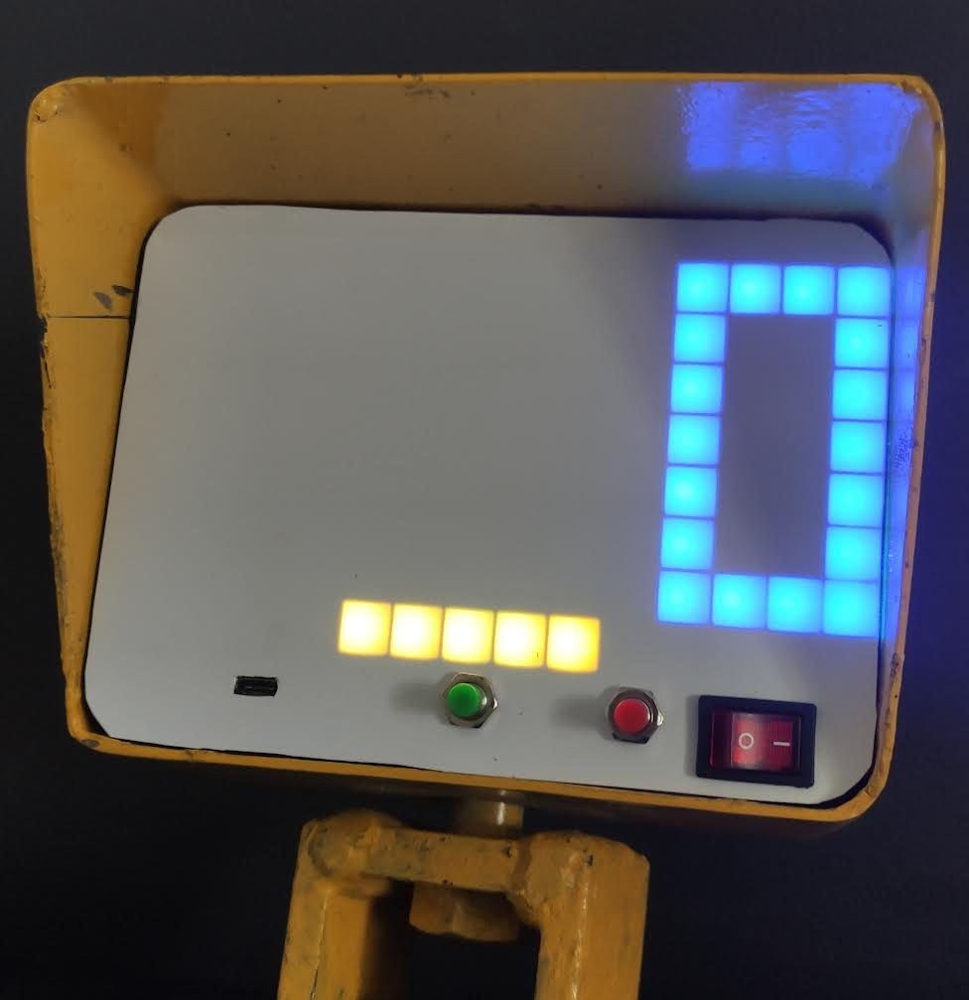

# crane-scale
Crane scale project using ESP32(M5Stack Atom) and HX711 Load Cell Amplifier

  

## Structure
Two main task were cereated that run on separate cores
- dataTask - is responsible for acquiring multi sampled data from HX711 which take around(700ms), reading battery voltage and sending this two values to second task
- mainTask - is used to display data, update BLE characteristic, listen for button inputs

## Customisation
Data is displayed using WS2812b matrix 8x15(it is cutten version of 8x32 matrix) you can use own display by reimplementing own functions in `display.cpp`

## Configuration
Configuration is done using BLE. There are 5 exposed characteristic
| Characteristic | Purpose |
| --- | --- |
| Weight | broadcast, notify current weight value |
| Calibration | used for calibrating load cell |
| Tare | when any value is written scale will tare itself |
| Battery | for reading battery status |
| Display Brightness | for configuring display brightness |

## Calibration
Calibration is done with BLE Calibration characteristic(currently you can use app like nRF Connect)
1. Remove any object from scale
2. Write 'begin' using string to Calibration char.
3. Place known weight on scale
4. Write value of known weight to Calibration char.
5. Done calibration will be automaticly saved in memory

## Development 
Currently i'm developing PWA app which will allow to connect with device and display current weight, battery, allow to calibrate etc.
